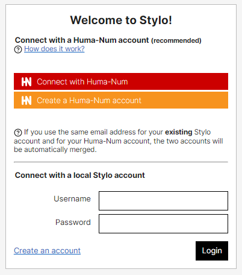
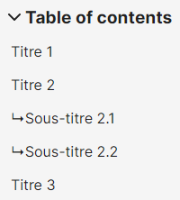

# First steps with Stylo

---

## Creating an account

In order to edit in Stylo, creating a user account via Huma-Num is recommended. To create an account, go to Stylo: https://stylo.huma-num.fr and choose the type of account (we recommend that you create a Huma-Num account or log in if you already have one):



If you already have a Stylo or Huma-Num account, log in [here](https://stylo.huma-num.fr).

## User page

The home page of your Stylo account lists your personal articles as well as those that have been shared with you by other Stylo users.

By default, a first article, called "How to Stylo", appears on the platform, and it details each involved with writing an article. Do not hesitate to refer to it if you wish to write your article directly in Stylo, or if you have questions about articles that require special treatment (illustrations, etc.).

For each article, many actions are possible:

|Button|Function|
|:-:|:--|
|  | To open the article and edit|
|  | To share the article and its version history with another Stylo user. It will be called: "[Copy]New article"|
|  | To duplicate only the last version of the article|
|  | To rename the article|
|  | To delete the article|
|  | To expand other functions relating to the article|
|  | To consult the history of saved versions|
|  | To choose the tags of the article|

Note: The document name, as it visible in Stylo, does not correspond to the title of the article that will be generated. The title must be filled in the metadata (right pane on the article) to appear on the preview or the exports.

**Careful :** Deleting an article is irreversible. If the article is shared with another user, it will remain available for this user even after it is deleted.

## Understand the article structure

An article in Stylo is made up of the following three separate elements:

  - The text body;
  - Metadata;
  - A bibliography.

Stylo offers an integrated interface to edit each of these elements, whose sources are accessible at any time via [the export module](premierspas.md#Export).

## Editing interface

The article editing interface offers many modules:

  - A **body text**: a space for editing the body text of the article;
  - A **metadata manager**: a space for editing information about the article (summary, author, keywords, publication date, etc.);
  - A **version manager**: a space for saving and renaming minor (*Create Minor*) and major (*Create Major*) versions, that accesses successive versions to consult, export and compare them with other versions;
  - A **table of contents**: automatically presenting a summary of the article, based on the titles within body text;
  - A **bibliography manager**: a space for editing references (quoted or not in the body text);
  - A **statistics** tool: presenting statistical information about the article (words and characters count, etc.).


## Share option

The **[Share]** function allows you to invite co-authors to work on the same article. These users then have access to the entire history. The article versions will synchronize for all the users as modifications are made to the document.

**Careful** : Sharing an article with another user is possible only by entering the email address that the other user entered to create their Stylo account.

## New article

To create a new article, simply click on the button:


You must then enter the name of the document in the field provided for this purpose


and validate the operation by once again clicking on the button


During this operation, you can also choose the tags related to the article:


The article will then appear in your list of articles. 

Click on the button


to access the editing environment and begin to work on your article.

## Import

If the content that you intended to edit is already structured in another format, in another environment, it is possible to transfer it into the Stylo editing space. Stylo essentially edits Markdown language (extension .md): to import content currently in DOC format (extension .doc) or DOCX (extension .docx), we have set up an [online converter](https://stylo-export.ecrituresnumeriques.ca/importdocx.html), which allows you to convert a docx document to md. The procedure is detailed on the conversion page.


Once you have converted, an md. document is generated: open it with a text editor (Atom, GeDit), and copy/paste the document content into the space of your Stylo article.

## Editing

The editing environment is made up of 5 modules:

- In the center: the writing space dedicated to the body text of the article;
- To the right: the **[Metadata]** button opens the metadata editor;
- To the left:
  - The history of document versions (*Versions*) to navigate and interact with different saved versions;
  - The *Table of contents* lists the titles at 2^nd^, 3^rd^, 4^th^, etc. levels;
  - The *Bibliography* lists the bibliographic references;
  - The *Stats* offer some quantitative data on the article.

## Writing in Markdown

The Stylo article must be written in Markdown, an easy-to-learn markup language.

Markdown language allows a syntax structure that is easy to both read and write. Here are the main writing rules for Markdown:

- Title: the levels of the title (level 1 for the title of the article, level 2 for the titles of the section, etc.) are organised using ```#```, like this: 
	- ```# Title of the article```, ```## Introduction```, etc.

**Careful**: The article's body text does not support titles for level 1; titles for level 1 are only used for the *Title* fields in the metadata.

- **Italics**: italics can be created in two ways: ```_word_``` or ```*word*``` 
- **Bold**: bold can be created like this: ```**word**```
- **Long citation**: long citations are created like this: ```> long citation```
- **Footnote**: a footnote can be created with or without a number:
	- with a number :

```
Here is my text[^1]

[^1]:A footnote with a number and reference
```

- Without a number :

```
Here is my text^[inline footnote.]
```

To improve your knowledge in Markdown syntax, you can see this [page](http://stylo-doc.ecrituresnumeriques.ca/fr_FR/#!pages/syntaxemarkdown.md).

## Versions


A document version corresponds to a backup of your work. A version always contains the following article elements: metadata, bibliography, body text. Therefore, in loading an old version, each of these three elements are updated.

Your work is automatically saved on Stylo by default, but you must create the versions yourself. To do this, you can - and it is recommended - use the save function [New Version] which allows you to generate a new version of the work:


Thus, when you have created a version that you are satisfied with, you can name your version in the *Version label* field before saving it as a minor ([Create Minor]) or major ([Create Major]) version.


A minor release is a release with minor changes, while a major release is a release with significant changes.

At any time, you can view your work, whether it is the current version you are editing or previous versions. Just click on the **[preview]** button:


Each version contains many functions:

- For the editable version (*Edition*):

|Button|Function|
|:-:|:--|
|  | To save a major version of your work |
|  | To save a minor version of your work |
|  | To export and save the version in different formats |
|  | To access the preview of your work and annotate it |

- For a previous version :
	- **[Compare]** to compare different versions (a previous version and the current version or two previous versions). For more information about the **[Compare]** function, you can consult the following [page](http://stylo-doc.ecrituresnumeriques.ca/fr_FR/#!pages/interface.md)
	- **[Export]** to export and download the document in different formats: HTML5, PDF, XML, etc.
	- **[preview]** to access a preview of your work and to annotate it. For more information on the **[preview]** function, you can see this [page](http://stylo-doc.ecrituresnumeriques.ca/fr_FR/#!pages/preview.md)

To view a previous version, simply click on its title. To return to the editable version, you must click on the **[Edit]** button.

## Export

The export module offers many formats (HTML, XML, PDF, etc.), allowing you to choose a bibliographic style, and the inclusion or not of a table of contents.

For more information on Stylo exporting, you can see this [page](http://stylo-doc.ecrituresnumeriques.ca/fr_FR/#!pages/export.md)

## Summary



The summary appears in a list of titles at levels 1, 2, and so on. These titles are clickable, for quick access to that part of the corresponding text.

## Bibliography

The bibliography lists the bibliographic references that you have added. The bibliographic references can be added either one by one, or grouped. To add your reference, you have to click on **[Manage Bibliography]** in the left pane: the *Bibliography* tool then opens and offers you a number of possibilities:

1. **Zotero** : you can synchronize a bibliography by connecting Stylo to your Zotero account (private or public groups/collections). You can also indicate the URL of a collection in a public Zotero group;
2. **Citations** : you can manually fill in your bibliography using BibTex format;
3. **Raw bibtex** : to edit the BibTeX directly.

You can directly [structure your references in BibTex](http://www.andy-roberts.net/writing/latex/bibliographies), or export your references in BibTex with your bibliography management tool:

- See tutorials : <a class="btn btn-info" href="http://sens-public.org/IMG/pdf/Utiliser_Zotero.pdf" role="button">Zotero</a> <a class="btn btn-info" href="https://libguides.usask.ca/c.php?g=218034&p=1446316" role="button">Mendeley</a>

To add a reference to the article, you just need to click on the reference, then paste (Ctrl+V) the reference in the desired place of the text. This way, a click is the same as "copying" the reference key to the clipboard. Then, you just need to paste it into the body text.

An autocomplete system also allows you to display the available references by typing [@ or @ followed or not by the first letters of the reference identifier.


For more information on managing the bibliography, you can see this [page](http://stylo-doc.ecrituresnumeriques.ca/fr_FR/#!pages/bibliographie.md)

## Metadata


The [Metadata] button opens the metadata pane. Three editing modes are available:

1. **Basic Mode** : allows editing the basic metadata: title, subtitle, summaries, authors and keywords;
2. **Editor Mode** : allows editing all metadata related to a scholarly journal: article identifier, folder information, review information, journal categories, journal keywords, etc.;
2. **Raw Mode** : an editing space for an advanced user, where you can modify fields directly in the YAML format structure.

**Important**: In order to export an article, these fields must be filled in:

- A title;
- An author name.

For more information on metadata editing, you can see this [page](http://stylo-doc.ecrituresnumeriques.ca/fr_FR/#!pages/bibliographie.md)

**Careful**: In the metadata pane is the "Bibliography" division, including the *Display* option, which allows you to choose to view the bibliography either in its entirety ("All citations"), or just the references which have been cited in the body of the article ("Only used"). 


## Statistics


The *Stats* menu provides information on:

- The number of words;
- The number of characters, without spaces;
- The number of characters, with spaces;
- The number of citations.

## Annotation

There are two annotation possibilities:

1. Annotate a version;
2. Annotate the article.

To annotate a version, click on the version number you want to annotate and then click **[preview]**. A preview of the article in HTML will open with the annotation tool *Hypothes.is* on the right.


**Important**: If you annotate a version, your annotation will not be visible on the other version.

To annotate the article, click **[Preview (open a new window)]**. The annotations will relate to the article. However, given that the editable version is subject to changes, annotations can no longer be anchored in the correct parts of the text (which could have been deleted or moved).
