# Managing articles

---

Your articles are available on the page *Articles*, clickable via the sidebar of your Stylo account:

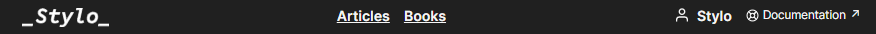

At the top of this page, there are a number of functions:

- Create a new article;
- Edit and manage tags;
- Search for an article.

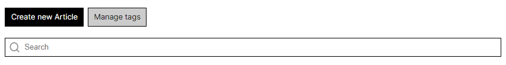

## Create a new article

Click on the button "Create new article" (you will need to fill in the article title in the box provided, then click again on the "Create this article" button again).

To create a new article, just click on the button:

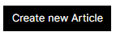.

You must then enter the name of the document in the appropriate field:

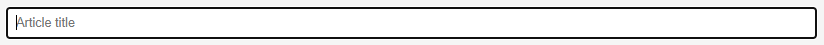

and validate by clicking on the button:

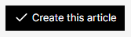.

While doing this, you can also add tags to the article by clicking on the button:

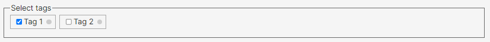

**Careful**: you can only add tags that are already edited in your Stylo account.

The article will now appear in your list of articles.

## Edit and manage your tags

To create and edit your tags, click on "Manage tags". A left pain the appears:

By clicking on the name of the tag, you can select in your list of articles only the articles concerned by the tag in question.

You can view the tag details by clicking on the rafter, which is positioned beside the tag name:

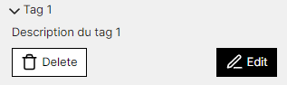

You then have access to the tag description in reading mode, but also to many other functions:

|Button|Function|
|:-:|:--|
| 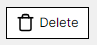 | To delete the tag|
| 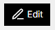 | To open the tag in editing|

The tag editing mode looks like this:

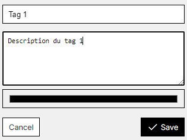

This space allows you to:

- Change the tag name;
- Change the tag description;
- Choose a tag colour.

Do not forget to save your changes once you have finished editing your tag.

## Search within your articles

A search sidebar appears to allow searching within your articles.

## Article pages in your Stylo account

On your Article page, your articles are listed one below the other according to your most recent changes:

Each article appears as a block in your list. This space is designed for just one article, and only allows you to perform a number of immediate operations:

|Button|Function|
|:-:|:--|
| 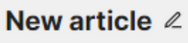 | To rename the article|
|  |  To preview the article|
| 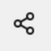 | To share the article and its version history with
another Stylo user|
| 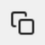 | To duplicate only the last version of the article. The copy will be titled as follows: "[Copy] Article Title"|
| 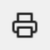 | To export the article|
|  | To open the article in editing mode|
| 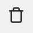 | To delete the article.|

You can also expand the article block by clicking on the rafter, positioned to the left of your article title. You will then have access to:

|Button|Function|
|:-:|:--|
| 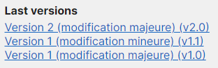 | To consult the history of saved versions|
|  | To select the tags of the article|

## Rename an article

You can rename your article by clicking on the pen icon located to the right of the current title of your article:

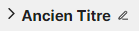

After having changed the article title to your liking, do not forget to save:

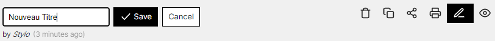

## Preview an article

You can preview your article by clicking on the following icon:

Previewing allows you to read the content of the article and the [annotation](http://stylo-doc.ecrituresnumeriques.ca/fr_FR/#!pages/preview.md).

## Share an article

You can also share your article with other Stylo users by clicking on the following icon:

To share, you must enter the email address of the Stylo user: it must be the address that the user entered to create the Stylo account. Once the address is entered, you must add to the list of users by clicking the button "Add".

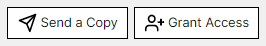

The [Grant Access] function allows multiple Stylo users to work on the same article. These users therefore have access to the entire history. The article versions will synchronise for all the users as changes are made to the document.

This feature also allows you to send a copy of the article.

The [Send a Copy] option is not an article sharing: only the latest version of the article will be visible to the user and the modifications will not be visible to other users. In the [Send a Copy] process, two versions of the article are created and the users each work on a version that is not visible to the other.

## Duplicate an article

You can duplicate your article by clicking on the following icon:

A duplicate of the article will then be generated and will appear at the top of the list of your Stylo articles. This article will be automatically titled as follows: "[Copy] Article title". This duplicate is created from the current article version (the one that you are in the process of editing) and does not contain the version history.

## Export an article

To export an article, click on the "Export" button from the "Articles" page or from the article's edit page:

The export menu allows you to choose the export format, the bibliographical style and whether or not to integrate the contents table.

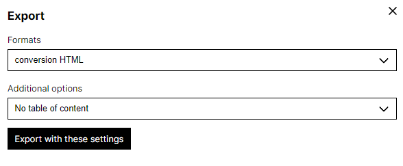

Supported formats are:

- Original files (Markdown, Yaml and BibTeX)
- HTML5
- LaTex
- PDF
- ODT (LibreOffice)
- DOCX (Microsoft Word)
- ICML (InDesign)
- XML-TEI
- XML-Erudit
- XML-TEI Commons Publishing (Metopes and OpenEdition)

It is possible to choose from several bibliographic styles, some of which integrate the reference into the text (Chicago, for example, which uses brackets to insert the reference into the body text) and others, who add a note with the reference.

The export module takes care of formatting the references, adding or removing spaces, inserting "Ibid." according to the style, etc.

Exports are produced thanks to the [pandoc](https://pandoc.org/) conversion tool, based on templates available here.

The export also allows you to download the source files of Stylo (.md, .bib, .yaml) and the media inserted in the article if there are any.

### Personalise the export

From the source files, it is possible to produce customized exports (layout, graphics, metadata) by using the [pandoc](https://pandoc.org/) conversion tool.

For more information on the use of templates, see this [tutoriel](https://framagit.org/marviro/tutorielmdpandoc/blob/master/parcours/04_edition.md#les-templates-dans-pandoc).

## Expand other article functions

To expand other article functions, you must click on the rafter, positioned to the left of the title of your article:

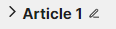

### Access versions of the article

You then have access to the major and minor versions of the articles: clicking on the name of a version takes you to the page in \"Editing\" mode of the version in question.

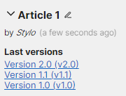

**Careful**: the page version to which you have access, although it is in \"Editing\" mode, does not allow you to change the content of the article. This is just a reading mode page from which you can [export]() and [compare]().

### Tag an article

You can also assign tags to your article from the list of current tags, simply by clicking on the tag you wish to add.

**Careful**: to create tags, you must refer to the [Manage tags] tool.

### Delete an article

To delete an article in your list of articles, click on the following icon:

A red tab will automatically open, informing you that your file will be deleted:

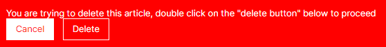

To permanently delete your article, you must double click on "Delete".
