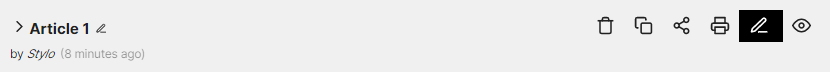
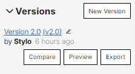

# Preview and annotate an article

---

## Preview

It is possible to preview a Stylo article in HTML with a default layout.

To preview an article, it is possible:

- To click on the "Preview" button from the "My articles" page, to the right of the "Edit" icon:

- To click on the "Preview" button from the article's editing page, at the top right of the body text:

The preview is available via a permalink that remains the same for the article's entire life. If the article is modified, the preview link will show the latest version of the article (remember to refresh the page to see the changes).

It is also possible to preview a particular version of the article. To do so, click on the "Preview" button in the article's edit page, in the left column, inside the "Versions" sub-menu.

A version's view link always displays the saved version.

## Annotate

In the preview page of a Stylo article, in the upper right corner of the browser, there is the [*Hypothesis*](https://web.hypothes.is/) annotation tool. To use it, you must create a *Hypothes.is* account ([Sign up](https://web.hypothes.is/start/)).

To annotate, select the section of text that you would like to comment: an annotation icon will appear. Please select the entire word, as required, and not only a letter or a typographic sign. You can *Highlight* or *Annotate*. The annotation can be private ("Post to Only me") or public ("Post to Public") and visible for other *Hypothes.is* users that have access to the article's preview URL.

There are two ways to annotate:

- Annotate a version of the article: annotations will be attached to this version only and will not be visible on other version previews.

To annotate a version, click on the version number you want to annotate and then click "**Preview**". A preview of the article in HTML will open with the *Hypothes.is* annotation tool on the right.

- Annotate the article's edit: annotations will be visible.

To annotate the article, click on "**Edit**" and then on "**Preview**". The annotations will relate to the article: they will be visible with each editable version. However, given that the article is subject to changes, the annotations may lose their anchors (if you were to delete the portions of text that they are tied to) and will be moved elsewhere in the article or will be lost.

### Additional resource information:
- [Explanatory video](https://youtu.be/zdQRv9wndcE)
